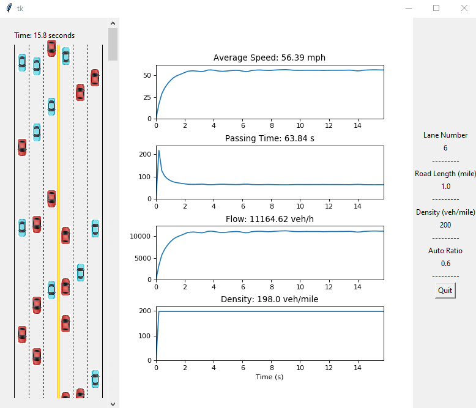

# Cellular automata traffic flow framework

A framework of cellular automata with visualization for traffic flow simulations. This framework has autonoumous vehicles included. You can make any change or invent new micro rules based on this framework. Details will be added later.

Dependencies:
- numpy
- matplotlib
- tkinker

General properties:
- Flexible. Road length and lane numbers are adjustable.
- High resolution. The cell size represents 1m while the vehicle size is 5m.
- Recursive road. Vehicles move from start to end, then re-enter the starting point.
- Lane changing included.

Note: We thank a paper from 2017 MCM Problem C that provides most of the details of my model. I cannot find the public repo of the author (if any). If you are the author, please feel free to let me know to address your contribution (The team control number is 55278, [paper link](https://myhome.spu.edu/lauw/MCM/4725%20Case%20Studies/2017%20Problem%20C%20Co-op/Co-op02.pdf)).

